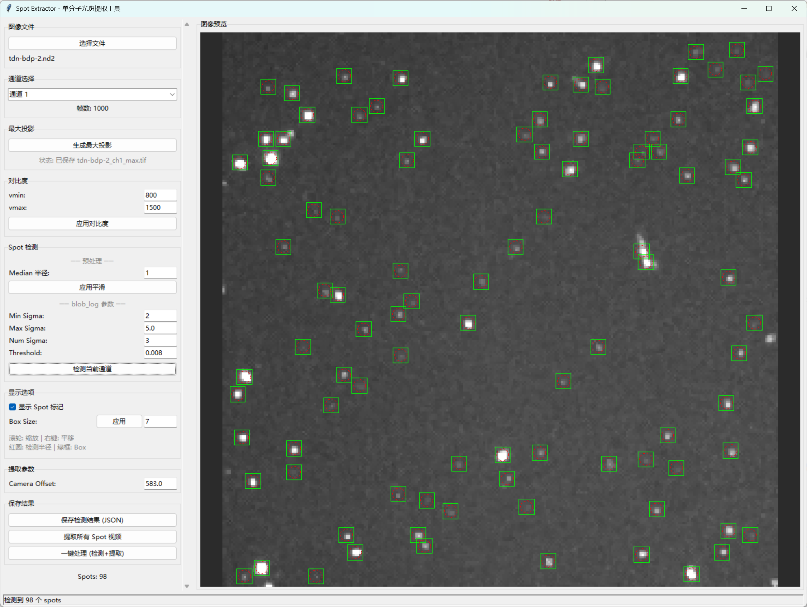
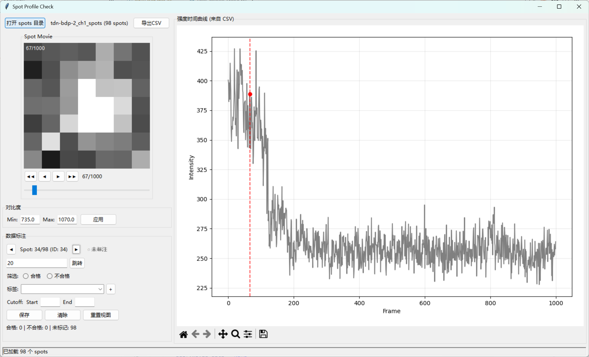

# Single-Molecule Imaging Data Preprocessing Tools

This toolkit is designed for preprocessing xyt/xyct imaging data acquired from Nikon N-STORM single-molecule fluorescence microscopes, including extraction and inspection of spot intensity traces.

## Tool List

| Tool | Function | Input | Output |
|------|----------|-------|--------|
| spot_extractor.py | Spot data extraction | ND2/TIFF files | TIFF + JSON + CSV |
| spot_profile_check.py | Spot data inspection | Spots directory | CSV |

## Installation

Create a Python virtual environment:

```bash
conda create -n smb python=3.10
```

Install dependencies:

```bash
conda activate smb
pip install aicsimageio[nd2] tifffile matplotlib numpy scikit-image pillow natsort
```

---

## spot_extractor.py - Spot Extraction Tool

One-stop extraction of maximum projections, spot detection, raw video, and fluorescence intensity time traces from ND2/TIFF raw data.

### Usage



```bash
python spot_extractor.py
```

### Features

- **Multi-format support**: ND2 files and multi-page TIFF (xyt format) as input
- **Multi-channel support**: Switch between channels via dropdown menu
- **Maximum projection**: Automatically generate and save maximum projections for each channel
- **Auto contrast**: Automatically set contrast based on image percentiles (1%/99%) after generating maximum projection
- **Spot detection**: Gaussian spot detection based on the `blob_log` algorithm
- **Raw video extraction**: Extract time-series video for each spot from raw data
- **Intensity trace calculation**: Calculate fluorescence intensity over time using a circular region defined by the detection radius

### Workflow

1. **Select file** - Load ND2 or TIFF (xyt) raw imaging data
2. **Select channel** - Choose the channel to process from the dropdown
3. **Generate maximum projection** - Click "Generate Maximum Projection"
4. **Adjust parameters** - Set preprocessing, detection parameters, and Camera Offset
5. **Detect spots** - Click "Detect Current Channel"
6. **Extract data** - Click "Extract All Spot Videos" or "One-Click Process"

### Output Files

Given an input file `sample.nd2` or `sample.tif`, the following outputs are generated:

```
sample.nd2 (or sample.tif)
├── sample_ch1_max.tif          # Channel 1 maximum projection
├── sample_ch1_spots.json       # Channel 1 detection results
└── sample_ch1_spots/           # Channel 1 spot data directory
    ├── 1.tif                   # Spot #1 raw video (time series)
    ├── 1.csv                   # Spot #1 intensity trace
    ├── 2.tif
    ├── 2.csv
    └── ...
```

### Intensity Calculation

The intensity time trace for each spot is calculated as follows:
- A circular region defined by the spot detection radius (red dashed circle) is used as the intensity calculation area
- Per-frame intensity = mean of (all pixel values - Camera Offset) within the circular region
- Camera Offset defaults to the minimum value of the current channel's raw data, and can be adjusted manually based on actual background levels
- Video output still uses the `box_size x box_size` square region

### Parameters

| Parameter | Default | Description |
|-----------|---------|-------------|
| Median Radius | 1 | Median filter denoising radius |
| Min Sigma | 3.0 | Minimum spot size |
| Max Sigma | 5.0 | Maximum spot size |
| Num Sigma | 3 | Number of sigma samples |
| Threshold | 0.03 | Detection threshold |
| Box Size | 7 | Side length of the extraction box (pixels), recommended to be inscribed in the dashed circle |
| Camera Offset | Auto | Defaults to the minimum value of raw data, can be adjusted manually |

### Output Formats

**JSON Detection Results** (`sample_ch1_spots.json`):

```json
{
  "source_file": "sample.nd2",
  "channel": 1,
  "image_shape": [512, 512],
  "parameters": {
    "preprocessing": {"median_size": 1},
    "detection": {"min_sigma": 3.0, "max_sigma": 5.0, "num_sigma": 3, "threshold": 0.03},
    "display": {"box_size": 7}
  },
  "spots": [
    {"id": 0, "x": 100.5, "y": 200.3, "radii": 4.2, "intensity": 5000},
    ...
  ],
  "spot_count": 50
}
```

**CSV Intensity Trace** (`1.csv`):

```csv
frame,intensity
0,123.5
1,125.2
2,124.8
...
```

### Shortcuts

| Action | Control |
|--------|---------|
| Zoom | Mouse scroll wheel |
| Pan | Right-click drag |
| One-click process | Automatically complete projection -> detection -> extraction |

---

## spot_profile_check.py - Spot Intensity Trace Inspection Tool



Inspect and annotate extracted spot intensity trace data, with support for exporting qualified data to CSV.

### Usage

```bash
python spot_profile_check.py
```

### Features

- **Video preview**: Display the spot's tif time-series video
- **Intensity trace**: Display the spot's fluorescence intensity over time (from CSV)
- **Data annotation**: Mark spots as qualified/unqualified
- **Multi-label support**: Add multiple labels (comma-separated)
- **Cutoff range**: Set a valid data range; the trace auto-scales accordingly
- **CSV export**: Export qualified spot data, including coordinate information

### Workflow

1. **Open directory** - Select the `{name}_spots/` directory
2. **Browse data** - View video and intensity traces; use frame navigation or slider to jump
3. **Annotate** - Set qualified/unqualified status, labels, and cutoff range
4. **Export** - Click "Export CSV" to save qualified data

### Annotation Shortcuts

| Action | Control |
|--------|---------|
| Mark qualified | Click "Qualified" or press `Q` |
| Mark unqualified | Click "Unqualified" or press `W` |
| Clear annotation | Press `E` |
| Next unannotated | Press `Space` |
| Switch spot | Press `Left` / `Right` arrow |

### Cutoff Range

After setting a valid data range:
- The trace auto-scales to the specified range
- The video auto-jumps to the middle frame of the range
- Cutoff values are recorded on export

### Output Files

**Annotation file** (`{spots_dir}/annotations.json`):

```json
{
  "directory": "path/to/spots",
  "total_spots": 100,
  "qualified_count": 50,
  "unqualified_count": 20,
  "annotations": {
    "1": {
      "qualified": "qualified",
      "labels": "good,bright",
      "cutoff_start": "10",
      "cutoff_end": "90"
    }
  }
}
```

**CSV export** (`{spots_dir}_qualified.csv`):

```csv
spot_id,x,y,qualified,labels,cutoff_start,cutoff_end
1,100.5,200.3,qualified,good,bright,10,90
2,150.2,180.7,qualified,,0,99
```

> **Note**: Coordinate information is read from the `{spots_dir}.json` file in the parent directory (generated by spot_extractor).

### Citation

If you use these tools in your research, please cite the following publication:

> Yao Xie et al., "Single-Molecule DNA Hybridization on Tetrahedral DNA Framework-Modified Surfaces", *Nano Letters*, 2025, DOI: [10.1021/acs.nanolett.5c01507](https://doi.org/10.1021/acs.nanolett.5c01507)

Your citation is very important for our continued development and maintenance of these tools. Thank you for your support!
